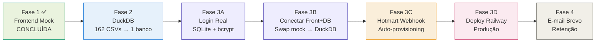

# AcheiMeuCliente — Plano TO-BE: Da Validação ao Produto Real

## Contexto: Evolução do Projeto (AS-IS)

O projeto passou por **5 etapas documentadas** no diretório `plano/`, culminando no `app.py` atual:

### Linha do tempo dos artefatos

| # | Artefato | O que definiu |
|---|----------|---------------|
| 1 | [plano_execucao_achei_meu_cliente.html](file:///r:/2026/Documentos%20-%202026/Sites/filtrador-leads/plano/plano_execucao_achei_meu_cliente.html) | **Estratégia de 3 fases**: ① Frontend com mock → ② DuckDB com 162 CSVs → ③ Conectar front+banco+login+Hotmart. Definiu 36 colunas, 2.97M empresas, 6 segmentos. |
| 2 | [mockup_ux_achei_meu_cliente.html](file:///r:/2026/Documentos%20-%202026/Sites/filtrador-leads/plano/mockup_ux_achei_meu_cliente.html) | **UX principal**: KPIs (Total, WhatsApp, E-mail, Idade média, Novas mês, Sem contador, Exports), gráficos CNAE top 5, barras por município, views Cards + Lista com expand de dados. |
| 3 | [mockup_v2_cnae_municipio_contato (1).html](file:///r:/2026/Documentos%20-%202026/Sites/filtrador-leads/plano/mockup_v2_cnae_municipio_contato%20(1).html) | **Refinamentos v2**: Semáforo CNAE (verde=beleza principal, amarelo=secundário, vermelho=fora), view "Por Bairro", comunicação de contato ("confirme se é WhatsApp"), botões disabled quando sem contato. |
| 4 | [mockup_filtro.html](file:///r:/2026/Documentos%20-%202026/Sites/filtrador-leads/plano/mockup_filtro.html) | **Sidebar de filtros completa**: Visualizações salvas, filtros de Contato/Segmento/CNAE Principal/Origem CNAE/Localização cascata/Identificação/Características (Porte, MEI, Simples, Natureza Jurídica, Capital Social, Anos). Modal de salvar filtro. |
| 5 | [stack_bootstrapper_simples.html](file:///r:/2026/Documentos%20-%202026/Sites/filtrador-leads/plano/stack_bootstrapper_simples.html) | **Stack e infraestrutura**: Streamlit+DuckDB+Railway(R$35-60/mês)+Hotmart(webhook)+Brevo(e-mail)+SQLite(users). LGPD ok (CNPJ=público). Plano de ação 5 passos. |

### Estado atual do [app.py](file:///r:/2026/Documentos%20-%202026/Sites/filtrador-leads/app.py) (1.671 linhas)

O app **implementa a Fase 1 completa** (frontend com dados mock):

- ✅ Login com contas de teste (3 tiers)
- ✅ Sidebar com filtros completos (Contato, Segmento, Origem CNAE, Localização cascata, Busca texto, Porte, MEI, Simples, Anos atividade)
- ✅ Visualizações salvas (mock)
- ✅ 7 KPIs (Total, WhatsApp, E-mail, Idade média, Novas mês, Sem contador, Exports)
- ✅ Gráficos Plotly (CNAE Principal top 5, CNAE Secundário top 5, Municípios top 6)
- ✅ 3 views: Cards (com semáforo CNAE, expand detalhado) / Lista completa / Por Bairro
- ✅ Download CSV + Excel com controle por tier
- ✅ ~25 registros mock cobrindo SP, MG, RJ, PR, RS, BA, GO (todos os 6 segmentos)
- ✅ CSS extenso com design system completo

> [!IMPORTANT]
> **A Fase 1 está CONCLUÍDA.** O produto visual está validado. Agora é hora de executar as Fases 2 e 3 para transformar o protótipo em produto real.

---

## Plano TO-BE: Fases 2 e 3

### Visão geral



---

### FASE 2 — Converter 162 CSVs → 1 DuckDB

> **Quem executa**: Script Python que o usuário roda 1 vez na máquina local
> **Tempo estimado**: 1-2 horas (escrita do script + execução)

#### [NEW] build_duckdb.py

Script de conversão que:

1. **Descobre automaticamente** as pastas com CSVs (estrutura: `/{CNAE_CODE}/{ESTADO}.csv`)
2. **Mapeia CNAE → Segmento** usando o dicionário `BEAUTY_CNAES` do app.py
3. **Normaliza colunas** para garantir consistência entre os 162 arquivos
4. **Adiciona colunas derivadas**:
   - `SEGMENTO` — calculado a partir do CNAE
   - `ARQUIVO_ORIGEM` — rastreabilidade do CSV de origem
   - `CNAE_MATCHED` / `ORIGEM_CNAE` — classificação do match de beleza
   - `TEM_EMAIL` / `TEM_TELEFONE` / `EMAIL_CONTABILIDADE` — flags booleanas
   - `ANOS_ATIVIDADE` — calculado a partir de `INICIO ATIVIDADE`
5. **Deduplica por CNPJ** (mantém o registro com CNAE de beleza como principal)
6. **Cria índices** em: `ESTADO`, `MUNICIPIO`, `SEGMENTO`, `TEM_EMAIL`, `CNAE_PRINCIPAL_CODIGO`, `PORTE`
7. **Valida**: conta registros por segmento e estado, compara com totais esperados
8. **Gera**: `empresas.duckdb` (~800MB–1.5GB)

```python
# Pseudocódigo do script
import duckdb, glob, pandas as pd

CNAE_TO_SEGMENT = {
    "9602501": "Salões e Barbearias",
    "9602502": "Clínicas de Estética",
    "4646001": "Distribuidores Atacadistas",
    "4772500": "Lojas e Pontos de Venda",
    "4635401": "Representantes e Agentes",
    "2063100": "Fábricas e Marcas",
}

def build():
    con = duckdb.connect("empresas.duckdb")
    # Para cada pasta CNAE → para cada CSV de estado
    # Ler, normalizar, adicionar SEGMENTO, INSERT
    # Criar índices
    # Validar contagens
    con.close()
```

> [!IMPORTANT]
> **Preciso saber**: Qual é a estrutura exata das pastas dos seus 162 CSVs? Exemplo: `C:\dados\9602501\SP.csv` ou outra organização? E as 34 colunas originais dos CSVs, os nomes batem exatamente com os usados no app.py?

---

### FASE 3A — Login Real com SQLite

> **Tempo estimado**: ~30 min de código

#### [NEW] auth.py

Módulo de autenticação isolado com:

```python
# Funções principais
init_db()           # Cria tabela users se não existe
create_user(email, password, tier, hotmart_id=None)
verify_login(email, password) -> dict | None
get_user(email) -> dict
update_exports(email, count)
reset_monthly_exports()  # Cron job mensal
change_tier(email, new_tier)
deactivate_user(email)
```

**Tabela `users` no SQLite**:

| Coluna | Tipo | Descrição |
|--------|------|-----------|
| id | INTEGER PK | Auto increment |
| email | TEXT UNIQUE | Login do usuário |
| password_hash | TEXT | bcrypt hash |
| nome | TEXT | Nome do cliente |
| tier | TEXT | explorador/operacional/regional/nacional |
| exports_used | INTEGER | Exports usados no mês corrente |
| exports_month | TEXT | YYYY-MM do reset (para saber quando zerar) |
| hotmart_id | TEXT | ID da transação Hotmart |
| created_at | DATETIME | Data de criação |
| active | BOOLEAN | Se a conta está ativa |

---

### FASE 3B — Conectar Frontend ao DuckDB

> **Tempo estimado**: ~1 hora

#### [MODIFY] [app.py](file:///r:/2026/Documentos%20-%202026/Sites/filtrador-leads/app.py)

Mudanças necessárias:

1. **Substituir `get_data()` mock** (linhas 327-846, ~520 linhas de dados fake) por consulta DuckDB:

```python
@st.cache_data(ttl=300)
def get_data(estado_filter=None) -> pd.DataFrame:
    con = duckdb.connect("empresas.duckdb", read_only=True)
    query = "SELECT * FROM empresas"
    if estado_filter:
        query += f" WHERE ESTADO IN ({','.join('?' for _ in estado_filter)})"
    df = con.execute(query, estado_filter or []).fetchdf()
    con.close()
    return df
```

2. **Substituir login mock** (`MOCK_USERS` + `show_login()`) por `auth.py`:
   - `show_login()` → chama `auth.verify_login()`
   - `st.session_state.user` → populado a partir do SQLite
   - Adicionar "Esqueci minha senha" (link ou fluxo simples)

3. **Controle de exports real**:
   - No download, incrementar `exports_used` no SQLite
   - Verificar limite antes de permitir download
   - Reset automático mensal

4. **Paginação**: Com 2.97M registros, não dá para carregar tudo. Implementar:
   - Query DuckDB com `LIMIT/OFFSET` ou
   - Filtro obrigatório de estado (tier controla quais estados o usuário vê)

5. **Tier enforcement**:
   - `explorador`: vê dados mas sem download
   - `operacional`: 1 estado, 300 exports/mês
   - `regional`: 5 estados, 1000 exports/mês
   - `nacional`: 27 estados, ilimitado

#### [MODIFY] [requirements.txt](file:///r:/2026/Documentos%20-%202026/Sites/filtrador-leads/requirements.txt)

Adicionar:
```
duckdb>=1.0.0
bcrypt>=4.1.0
```

---

### FASE 3C — Webhook Hotmart

> **Tempo estimado**: ~1 hora

#### [NEW] webhook.py

Endpoint Flask/FastAPI (ou rota Streamlit custom) que:

1. Recebe POST do Hotmart com dados da compra
2. Valida o `hottok` (token de segurança do Hotmart)
3. Extrai: email do comprador, nome, produto (= tier)
4. Chama `auth.create_user()` com senha temporária gerada
5. Envia e-mail via Brevo com credenciais de acesso
6. Trata eventos: `PURCHASE_COMPLETE`, `PURCHASE_CANCELED`, `SUBSCRIPTION_CANCELLATION`

> [!WARNING]
> O Streamlit não tem suporte nativo a webhooks HTTP. Há duas opções:
> 1. **Flask separado** rodando na mesma instância Railway (porta diferente)
> 2. **Streamlit com `st.query_params`** para receber callbacks simples (limitado)
> 
> A opção 1 (Flask) é mais robusta para webhooks.

---

### FASE 3D — Deploy Railway

> **Tempo estimado**: 30 min (com guia)

#### [NEW] Procfile
```
web: streamlit run app.py --server.port $PORT --server.headless true
```

#### [NEW] railway.toml
```toml
[build]
builder = "NIXPACKS"

[deploy]
startCommand = "streamlit run app.py --server.port $PORT --server.headless true"
```

#### Passos de deploy:
1. Push do código para GitHub
2. Conectar repo no Railway
3. Upload do `empresas.duckdb` para volume persistente
4. Upload do `users.db` (SQLite) para volume persistente
5. Configurar variável de ambiente: `HOTMART_TOKEN`, `BREVO_API_KEY`
6. Configurar domínio customizado (opcional)

---

### FASE 4 — E-mail Brevo (Retenção)

> **Tempo estimado**: 1 hora (código) + 1 hora (configuração Brevo)

#### [NEW] email_service.py

```python
# Funções
send_welcome(email, nome, senha_temp, tier)
send_weekly_digest(email, nome, novas_empresas_count, estado)
send_export_warning(email, nome, used, limit)
send_expiration_warning(email, nome, days_left)
send_winback(email, nome)
```

#### [NEW] cron_jobs.py

Script para rodar com cron ou Railway scheduled task:
- **Segunda 08h**: Enviar digest semanal para todos os ativos
- **Dia 1 do mês**: Reset de exports de todos os usuários
- **Diário**: Verificar expirações próximas (5 dias, 1 dia)

---

## Resumo de arquivos

| Ação | Arquivo | Fase |
|------|---------|------|
| [NEW] | `build_duckdb.py` | 2 |
| [NEW] | `auth.py` | 3A |
| [MODIFY] | `app.py` (remover ~520 linhas mock, adicionar DuckDB + auth real) | 3B |
| [MODIFY] | `requirements.txt` (adicionar duckdb, bcrypt) | 3B |
| [NEW] | `webhook.py` | 3C |
| [NEW] | `Procfile` | 3D |
| [NEW] | `railway.toml` | 3D |
| [NEW] | `email_service.py` | 4 |
| [NEW] | `cron_jobs.py` | 4 |

---

## Open Questions

> [!IMPORTANT]
> **1. Estrutura dos CSVs**: Preciso saber a organização exata das pastas/arquivos dos 162 CSVs para escrever o `build_duckdb.py`. Qual é o path? Como são nomeados?

> [!IMPORTANT]
> **2. Colunas dos CSVs**: Os nomes das 34 colunas nos CSVs reais batem exatamente com os usados no app.py (RAZÃO SOCIAL, NOME FANTASIA, CNPJ, WHATSAPP_1, etc.)? Ou precisam de mapeamento?

> [!IMPORTANT]
> **3. Prioridade de execução**: Quer que eu comece pela Fase 2 (script DuckDB) ou pela Fase 3A/3B (auth + swap de dados) primeiro? A Fase 2 depende da sua máquina para rodar; a 3A/3B pode ser feita em paralelo.

> [!NOTE]
> **4. Webhook Hotmart**: Você já tem produtos cadastrados no Hotmart com os 4 tiers? Ou precisa criar? Preciso saber os nomes/IDs dos produtos para mapear para os tiers.

> [!NOTE]
> **5. Domínio**: Já tem domínio comprado (ex: acheimeucliente.com.br)? Ou vai usar o subdomínio do Railway por enquanto?

---

## Verification Plan

### Automated Tests
```bash
# Fase 2 - Validação do DuckDB
python build_duckdb.py --validate  # Conta registros por segmento/estado

# Fase 3A - Testes de auth
python -c "from auth import *; init_db(); create_user('test@test.com','123','operacional'); print(verify_login('test@test.com','123'))"

# Fase 3B - App rodando com DuckDB
streamlit run app.py  # Verificar filtros com dados reais
```

### Manual Verification
- Testar login com conta criada via SQLite
- Testar controle de exports (baixar, verificar contador, atingir limite)
- Testar webhook com Hotmart sandbox
- Verificar performance com 2.97M registros (filtro em <2s)
- Testar deploy no Railway
